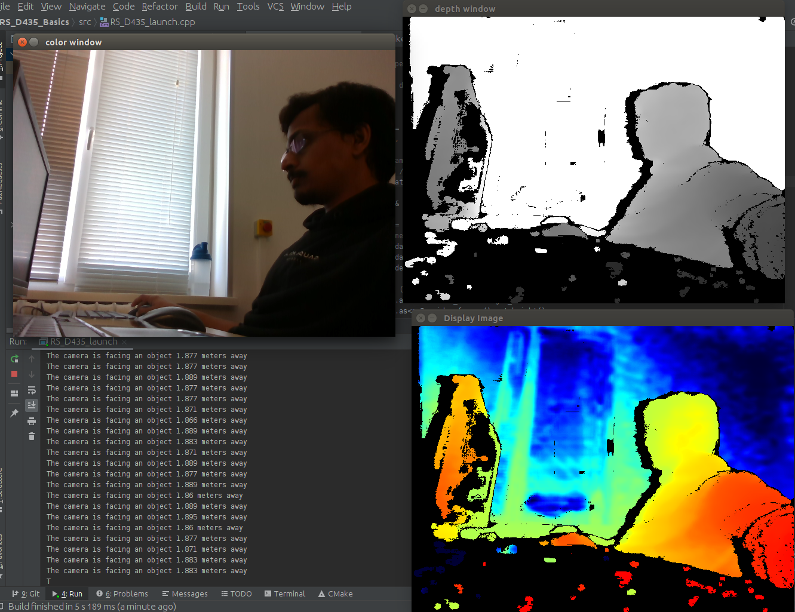

# D435 basics applications with OpenCV on Jetson Tx2



### This is a extension of basic code example [Hello-realsense](https://github.com/IntelRealSense/librealsense/tree/master/examples/hello-realsense).

I have modified the example code and processed the RS frames using OpenCV such a way that, they will produce 3 different 
outputs as shown in above.

## To run on your JetsonTx2

 **_`TO DO`_**

## To run on your system (Linux)
1. Build *`OpenCV`* from source using [guide](https://docs.opencv.org/trunk/d7/d9f/tutorial_linux_install.html) 
2. Build librealsense from source using [these instrunction]()
3. clone this repository

        `$ git clone https://github.com/Ashutosh-Badave/RS_D435_Basics.git`
        
4. create build folder
        `$ cd RS_D435_Basics` 
        
        `$ mkdir build && cd build`
        
5. cmake and run
        
        ```
        $ cmake ..
       
        $ make

        $ ./RS_D435_launch
        ```

### I have created play and save buttons for my convince. 
When you run it, you need to press a key to start and stop the video stream. If you press *`s`* to stop then all three 
window outputs will gets saved in output folder.   
 